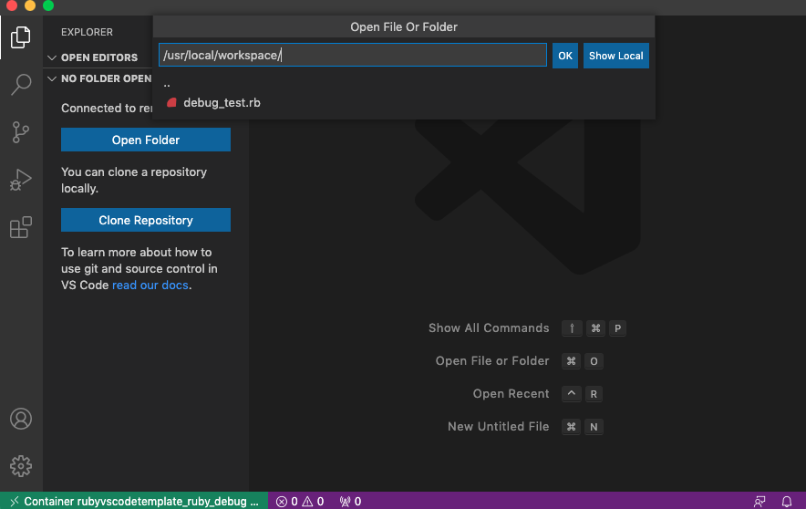
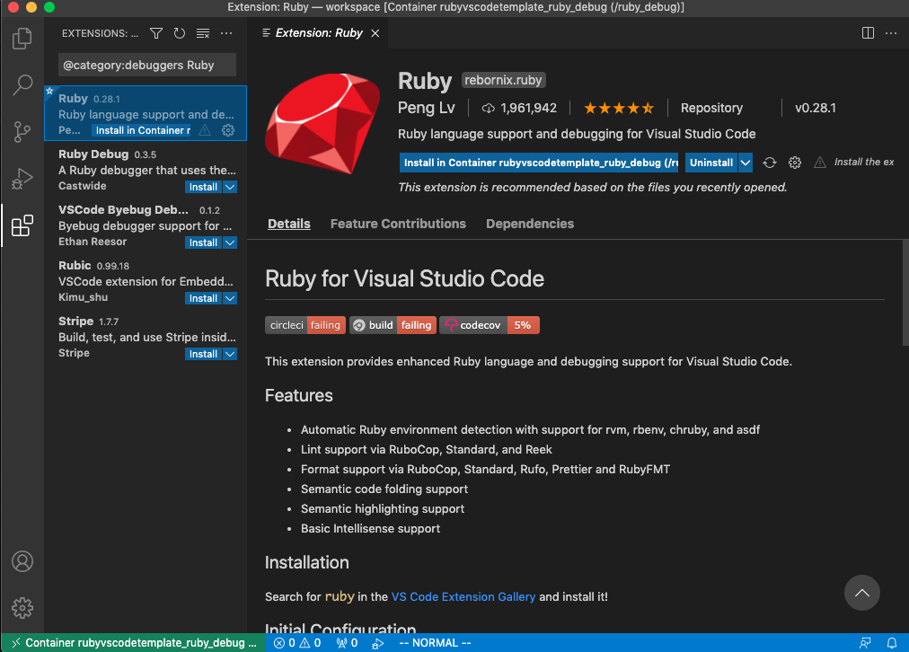
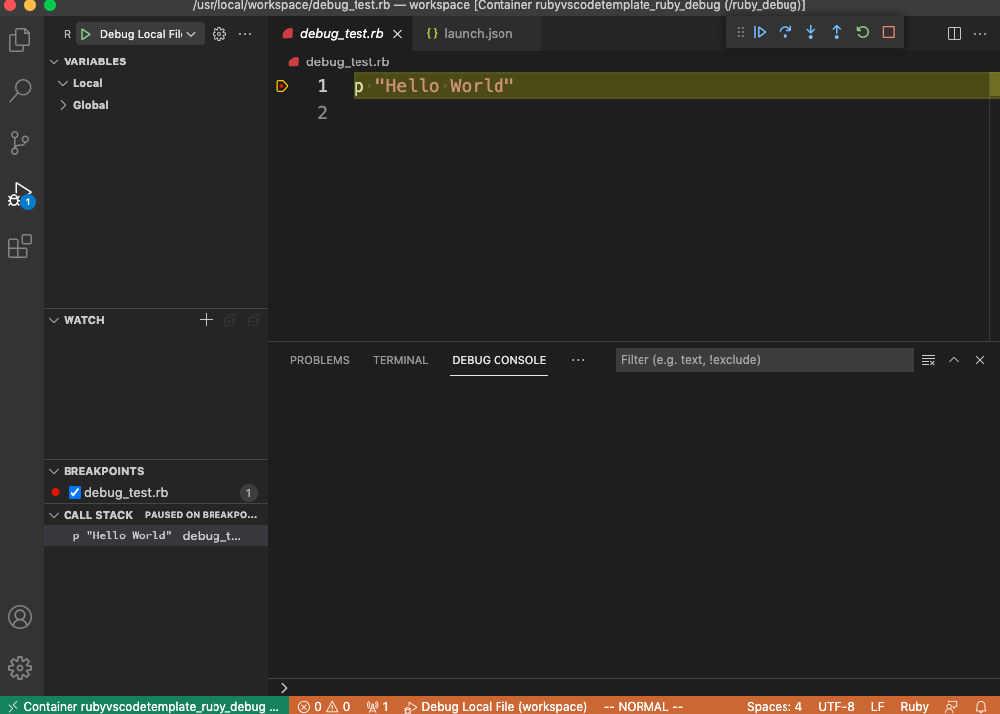

RubyVSCodeTemplate
===

VSCode で、Docker コンテナ上の Ruby プログラムをデバッグするための環境構築セットです。

## Requirement

### ローカルホスト
- VSCode extension
    - Remote - Containers: https://marketplace.visualstudio.com/items?itemName=ms-vscode-remote.remote-containers

### リモートコンテナ
- VSCode extension
    - Ruby: https://marketplace.visualstudio.com/items?itemName=rebornix.Ruby

## Usage

1. コンテナイメージのビルド。

```
Docker compose build
```

2. コンテナの起動。

```
Docker compose up
```

3. VSCode からリモートコンテナへアタッチ。
4. ワークスペースフォルダとして、```/usr/local/workspace``` を追加。



5. VSCode の拡張に、Ruby をインストール。



6. ```.vscode/launch.json``` を、リモートコンテナ側の構成ファイルとして設定。
7. ブレークポイントを設定してデバッグを実行できることを確認。


